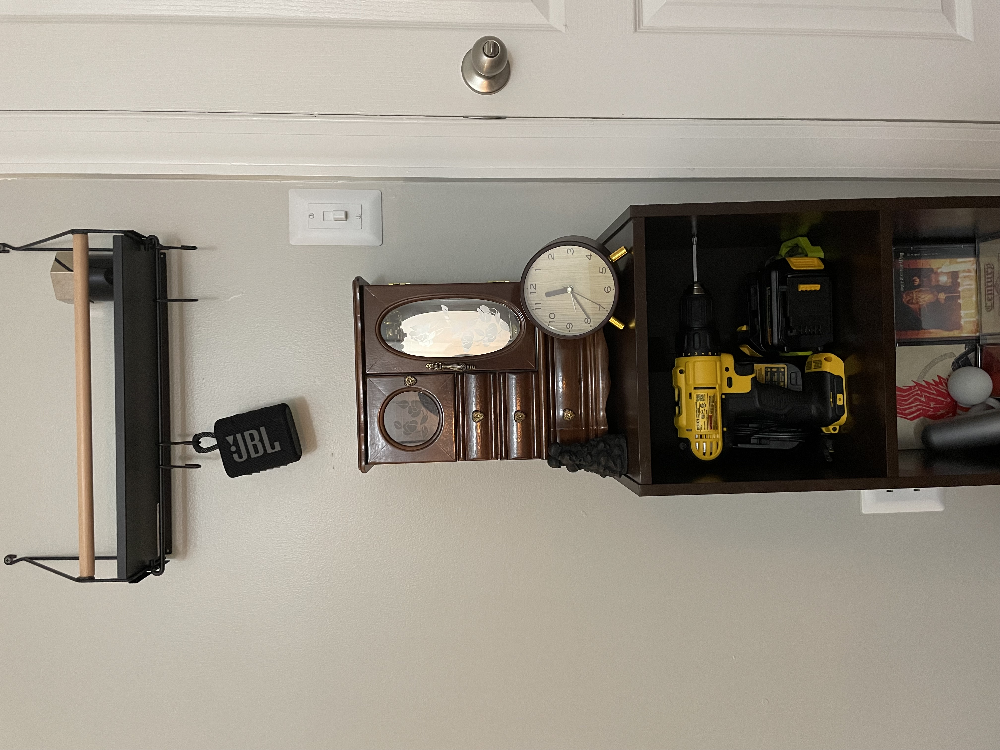
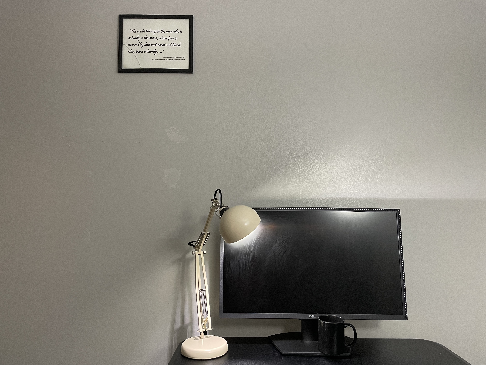
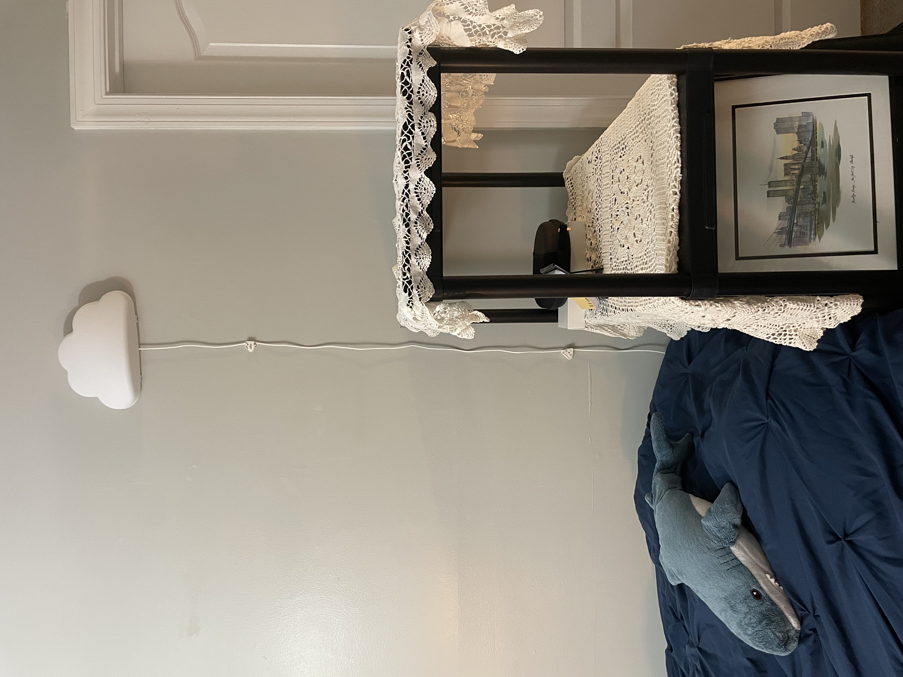

---
layout: post
title: "随笔 | 装修日记1"
---

新的个人网站: [taraliu.netlify.app](https://taraliu.netlify.app/)

大家好，我是醉舟也是兔子，好久​（两年）不见。时维九月，序属三秋，又开学了？！

上个月，我从租金高昂的城市中心搬到了树木密布的城市，这是我第一次拥有一个没有任何现成家具的房间，热爱鼓捣的我决定利用这个机会把家改造装修成​想象中的样子。

本科时期大部分时间住在宿舍和带有家具的房子里，我的改装主要局限于装饰性物品，比如：床头摆件、书桌挂饰、小手工贴纸。而这次，一切从零开始，我准备大动干戈​一番。

### 场地分析

我是合租的两室两厅公寓（也就是2b2b中的一个朝西的房间），公寓是上世纪的木结构建筑，周围有树林等自然风光，小动物很多；停车方便。公寓户型周正、南北通透，有半开放式厨房和室内阳台；客厅东侧窗外有美丽的树荫，我的房间窗外是人行道和一个球场。至于选择朝西次卧的原因，主要是节省房租，其次是房间小好打扫；再次，是之前北京的房间也是朝西，每天都能看到夕阳照耀，作为喜欢日落的人，我觉得挺幸福。

我的房间尺寸为开间3.6米 * 进深3.3米（即11*12英寸，讨厌美国的单位制！），带有干湿分离的卫生间和一个衣帽间，客厅还有另一个储藏间可以使用。房间优点是布局方正，储存空间充足，因此装修发挥空间较大；缺点是地面铺装是地毯而不是木地板，朝西早上没有阳光直射，蚊虫不可避免得比城市多。

### 装修主题与风格

我希望这个属于自己的房间可以映射我的风格，具有明确的分区与实用性。另外我作为学生还是囊中羞涩，当研究助理的工资只能维持温饱和油费，所以装修预算较低。

首先，风格确定，三个关键词：形式追随功能、年代感和怀旧、去性别化。下文我将一一解释。

形式追随功能：言出现代主义建筑师路易斯沙利文，我的理解是功能至上，不整虚的花活儿。住宅是居住的机器，我的房间用于居住、学习、休息放松、玩耍、网上冲浪，这些活动所需的功能必须被极致执行，以达到用户（本人）友好的效果。实用第一，而非以“美观“、”出片“为目的。

年代感和怀旧：也就是vintage，老古董。不必多言，我就是反感潮流的东西！喜欢让人觉得饱经风霜的玩意儿。

去性别化：暂时没找到更好的词语描述，大概就是当陌生人看到这个风格时，不知道主人是男是女。

综上，我希望这个房间是我的空间名片：重视功能与实用、激进反对美感，怀旧又有中性气质。

### 空间落位

我在开学前抓紧购入了大件家具和梦寐以求的电钻套装，制定了初步分区与装修计划。这几天在弄小件儿物品，主要是因为大件的得周末搬运。

1. 配色: 哑光黑、深咖啡棕、藏蓝、米白（顺序代表比例）。

2. 功能分区：休息区（床、床头灯、置物架）、学习区（站立桌、显示器、笔筒、台灯）、玩耍区（充电台、小沙发、置物架、小书柜）。

3. 材质：哑光黑色塑料、深咖啡棕木（颜色不统一的喷漆或刷漆处理成深咖啡棕色）、喷漆哑光黑色不锈钢、喷漆米色不锈钢、藏蓝木、米白蕾丝布。

4. 收纳：因为有衣帽间储物，所以房间内没有使用储物柜，不常用的东西全都放进衣帽间，眼不见心不烦！而且早上去衣帽间里选衣服很快乐，称得上是蚂蚁版玛丽苏文主角了（毕竟衣帽间只有两平米）。

### 个人偏好

喜欢制造充足的高差，比如躺在床上可以看到的高处的东西。讨厌东西摆在台面上，台面上只留最必要的东西，其他的要么全部挂上墙要么收进储藏间。

### 目前进度展示

今天该睡觉了，先拍几张照片放上来。

玩耍区（之后柜子会挂上墙的！）

工作区

休息区

预知后续，还请继续观看！

